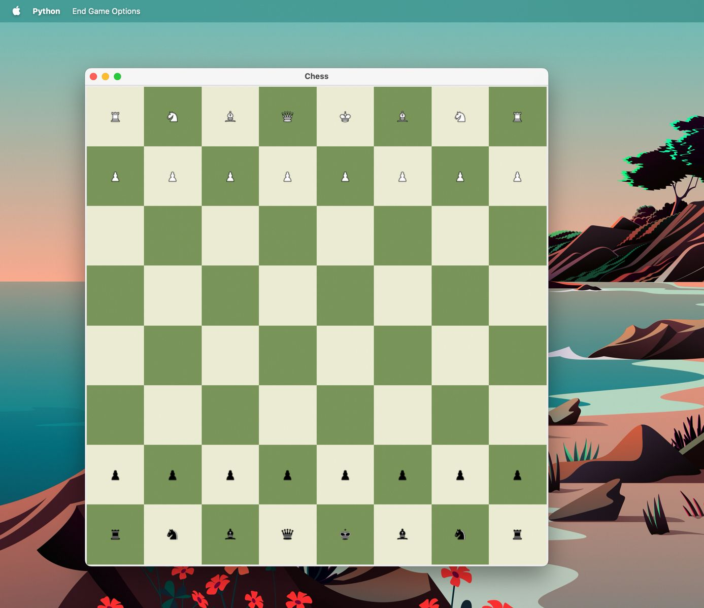

# Tk‑Šah (GUI)

Jednostavna, lokalna šahovska aplikacija s grafičkim sučeljem u Pythonu.  
Igraj protiv drugog igrača na istom računalu – aplikacija podržava sve osnovne šahovske poteze i pravila, uključujući:

- Rokadu
- En passant
- Promociju pješaka
- Pravilo 50 poteza
- Trostruko ponavljanje
- Pat, remi i predaju

Grafika koristi PNG slike figura i prilagođava se veličini prozora.

---

## Značajke

- [x] Tkinter sučelje
- [x] Prikaz mogućih poteza
- [x] Završetak igre s detekcijom remija ili mata
- [x] Dijalog za promociju
- [x] Sve u čistom Pythonu

---

## Pokretanje projekta

1. Kloniraj repozitorij ili preuzmi ZIP:

   ```bash
   git clone https://github.com/<tvoje-korisničko-ime>/tk-sah.git
   cd tk-sah
   ```

2. (Preporučeno) Stvori virtualno okruženje:

   ```bash
   python -m venv .venv
   ```

3. Instaliraj ovisnosti:

   ```bash
   pip install -r requirements.txt
   ```

4. Pokreni aplikaciju:
   ```bash
   python app.py
   ```

---

## Struktura projekta

```
.
├── app.py           # GUI logika (Tkinter)
├── chess.py         # Pravila šaha i logika igre
├── config.py        # Konstante (boje, veličina ploče, itd.)
├── images/          # PNG slike figura (bijele i crne)
├── requirements.txt # Python ovisnosti
└── README.md
```

---

## Plan za budućnost

- [ ] Dodavanje AI protivnika
- [ ] Undo / redo poteza
- [ ] Bolje upozorenje kada se desi šah
- [ ] Sat i mjerač vremena

---

U nastavku možete vidjeti screenshot igre:



---

## 👤 Autor

Bruno Marković  
GitHub: [@BrunoMarkovic](https://github.com/BrunoMarkovic)

---

> **Napomena:**  
> Kod je razvijen i testiran na macOS‑u. Na drugim operacijskim sustavima (npr. Windows), može doći do problema kao na primjer učitavanje slika.
